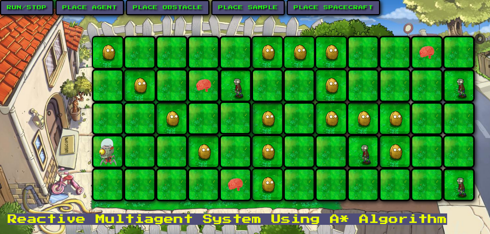
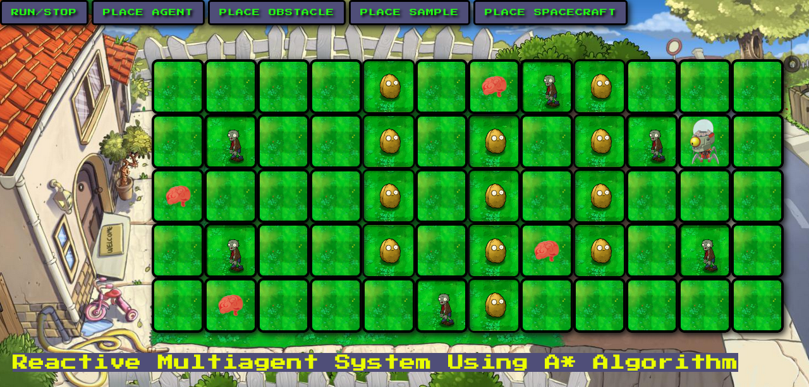

# Plants-vs-zombies-multi-agent-system-using-A-algorithm
This program, based on Plants vs. Zombies, simulates the problem of the sample-collecting robot (multi-agent system) proposed to be addressed using the A* informed search algorithm. In this system, samples are found and grouped into clusters, using crumbs to trace the path back to the ship, and the collaboration between agents is described.

https://pvz-reactive-multiagent.web.app/

&nbsp;&nbsp;&nbsp;

&nbsp;&nbsp;&nbsp;

